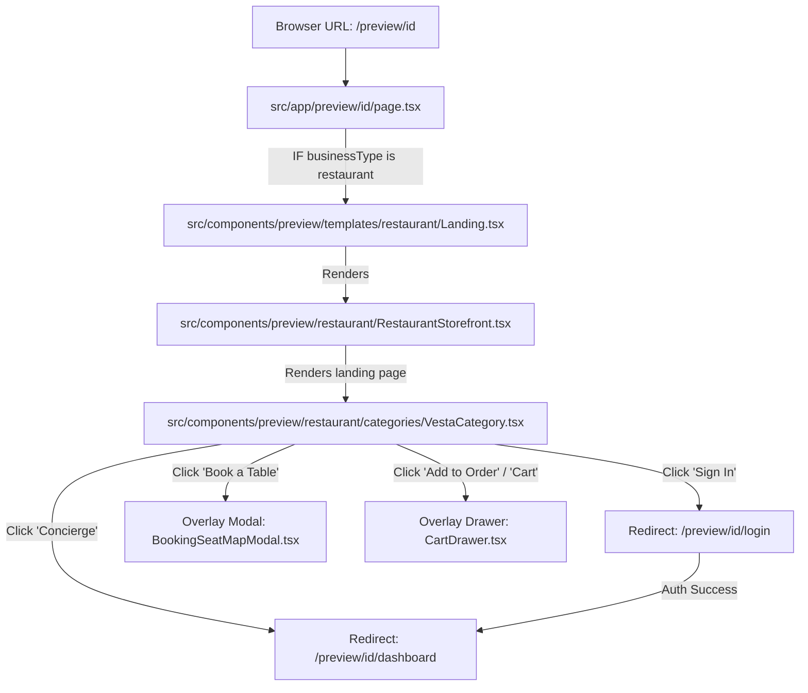

# ZATBIZ Frontend: Core Connections, Entry Points, and Routing Flow

This document explains the architecture of the restaurant storefront module in the ZATBIZ frontend, outlining the **main entry points**, how the files **connect**, and how the **routing/redirection** flows.

---

## 🗺️ Visual Architecture Flow

---

## 1. Main Entry Points (Main Files)

* **Root Page Router**: [page.tsx](file:///e:/ZATBIZ-ZATNEWR%20%282%29/ZATBIZ-ZATNEWR/zatbiz-frontend/src/app/preview/%5Bid%5D/page.tsx)
  * **Location**: `src/app/preview/[id]/page.tsx`
  * **Role**: This is the top-level loader. It fetches the project metadata, checks the database for restaurant configurations (`api.restaurant.get`), and loads the cart, session, and product states. If the project matches a restaurant, it renders the restaurant landing component.
* **Restaurant Storefront Shell**: [RestaurantStorefront.tsx](file:///e:/ZATBIZ-ZATNEWR%20%282%29/ZATBIZ-ZATNEWR/zatbiz-frontend/src/components/preview/restaurant/RestaurantStorefront.tsx)
  * **Location**: `src/components/preview/restaurant/RestaurantStorefront.tsx`
  * **Role**: Acts as the controller/router for the restaurant module. It parses customizer variables (e.g., logo, header layout styles, theme color presets) and delegates the main layout presentation.
* **The Landing Layout (Vesta)**: [VestaCategory.tsx](file:///e:/ZATBIZ-ZATNEWR%20%282%29/ZATBIZ-ZATNEWR/zatbiz-frontend/src/components/preview/restaurant/categories/VestaCategory.tsx)
  * **Location**: `src/components/preview/restaurant/categories/VestaCategory.tsx`
  * **Role**: The actual homepage template that the customer sees. It renders the navigation bar, hero image, menu dishes, ambiance text, contact information, scroll animations, and footer.

---

## 2. File Connections (How They Interact)

* **Data Injection**:
  * `page.tsx` fetches the items from database (`dbProducts`) and passes them down as props to `RestaurantStorefront.tsx`, which forwards them to `VestaCategory.tsx` to display on the menu cards.
* **Overlays & Dialogs**:
  * **Cart System**: When a customer clicks "Add to Order" on a card in `VestaCategory.tsx`, it triggers the `onAddToCart` prop function defined in `page.tsx`. If they click the cart button, it triggers `onViewCart` which opens [CartDrawer.tsx](file:///e:/ZATBIZ-ZATNEWR%20%282%29/ZATBIZ-ZATNEWR/zatbiz-frontend/src/components/preview/restaurant/CartDrawer.tsx).
  * **Reservations Modal**: Clicking "Book a Table" inside `VestaCategory.tsx` triggers the `setIsBookingModalOpen` state from the storefront, rendering [BookingSeatMapModal.tsx](file:///e:/ZATBIZ-ZATNEWR%20%282%29/ZATBIZ-ZATNEWR/zatbiz-frontend/src/components/preview/restaurant/BookingSeatMapModal.tsx) directly as an overlay over the page.

---

## 3. Redirection & Page Routing Flow

Next.js file-system routing governs the transitions between different sections of the customer workspace:

### A. The Landing Storefront
* **URL**: `/preview/[projectId]`
* **Renders**: `src/app/preview/[id]/page.tsx` -> `RestaurantStorefront.tsx` -> `VestaCategory.tsx`.
* **Redirection Trigger**:
  * Clicking navigation anchors (`The Table`, `Ambiance`, `Chef`, `Reserve`) performs smooth scrolling to corresponding page coordinates (`#table`, `#ambiance`, etc.).

### B. Client Authentication (Sign In / Sign Up)
* **URL**: `/preview/[projectId]/login`
* **File Location**: [login/page.tsx](file:///e:/ZATBIZ-ZATNEWR%20%282%29/ZATBIZ-ZATNEWR/zatbiz-frontend/src/app/preview/%5Bid%5D/login/page.tsx)
* **Redirection Trigger**:
  * In the `VestaCategory.tsx` header navbar, if `customerSession` is null, the "Sign In" link routes the user to `/preview/[id]/login`.
  * After completing authentication, the login form redirects the user to `/preview/[id]/dashboard`.

### C. Client Concierge Portal (Dashboard)
* **URL**: `/preview/[projectId]/dashboard`
* **File Location**: [dashboard/page.tsx](file:///e:/ZATBIZ-ZATNEWR%20%282%29/ZATBIZ-ZATNEWR/zatbiz-frontend/src/app/preview/%5Bid%5D/dashboard/page.tsx)
* **Redirection Trigger**:
  * In `VestaCategory.tsx` header navbar, if `customerSession` is active, the "Concierge" link appears and routes the user to `/preview/[id]/dashboard`.
  * This page loads the client dashboard layout (`CategoryDashboardTemplate.tsx`) allowing customers to review their order history and table reservation details.
